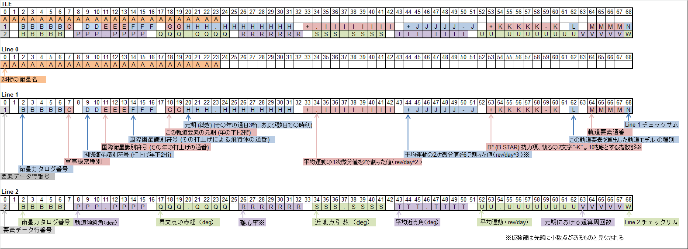

TLE
====
TLE(2行軌道要素形式)から人工衛星の各種軌道要素を取得するプログラム

概要
----
TLEの0行目、1行目、2行目を入力すると、各要素を切り出した構造体を返す。<br>
TLEは下図のようなフォーマットで記述されている<br>
<br>
Line 1とLine 2のチェックサムは利用せずに捨てている
TLEは[NORAD Two-Line Element Sets](http://celestrak.com/NORAD/elements/)などから入手することができる<br>

利用できる環境
----
cl (Windows 7) Version 19.11.25507.1 for x86とgcc (Ubuntu 5.4.0-6ubuntu1~16.04.2) 5.4.0 20160609でビルドを確認した。

要求
----
 * Windowsで使用する場合
   * [Microsoft Visual Studio Community 2017](https://www.microsoft.com/ja-jp/dev/products/community.aspx)<br>
   * [Windows SDK](https://developer.microsoft.com/ja-jp/windows/downloads/windows-8-1-sdk)<br>

注意
----
Windowsの場合には、開発者コマンドプロンプトや[Cygwin](https://www.cygwin.com/)、[MSYS2](http://www.msys2.org/)等のターミナルを用いてビルドする方法を説明する。<br>

インストール
----

方法1: ダウンロード
------
[releaseページ](https://github.com/mkaminaga/tle/releases)からzipファイルをダウンロードし、適当なディレクトリに展開する。<br>


方法2: クローン & ビルド -> スタティックリンクライブラリの作成
----

clの場合
```
$ git clone https://github.com/mkaminaga/tle
$ cd tle
$ vim tle_vc.mk
$ nmake /f tle_vc.mk | iconv -f cp932 -t utf-8
```

gccの場合
```
$ git clone https://github.com/mkaminaga/tle
$ cd tle
$ make -f tle.mk
```

使用方法
----
clの場合、リンク時に`tle.lib`を指定すること。<br>
gccの場合、リンク時に`libtle.a`を指定すること。<br>
makefileは必要に応じて書き換えること。<br>

リファレンス
----

入力データ構造体
------
`struct sat::TLEDesc`が入力データを格納する構造体である。<br>
リストは宣言順<br>

|メンバ変数|説明|単位|
|---|---|---|
|std::basic\_string<wchar_t> line\_0|TLE 0 行目|なし|
|std::basic\_string<wchar_t> line\_1|TLE 1 行目|なし|
|std::basic\_string<wchar_t> line\_2|TLE 2 行目|なし|

出力データ構造体
------
`struct sat::TLEData`が出力データを格納する構造体である。<br>
リストは宣言順<br>

|メンバ変数|説明|単位|
|---|---|---|
|int sat\_num|衛星カタログ番号|なし|
|int id\_1|国際衛星識別符号 (打上げ年の下2桁)|なし|
|int id\_2|国際衛星識別符号 (その年の打上げの通番)|なし|
|int model|この軌道要素を算出した軌道モデル<br>'1':SGP<br>'2':SGP4<br>'3':SDP4<br>'4':SGP8<br>'5':SDP8|なし|
|int s\_num|軌道要素通番|なし|
|int epoch\_year|この軌道要素の元期 (年の下2桁)|年|
|int rev|元期における通算周回数|rev|
|wchar\_t classification|軍事機密種別<br>'S':秘匿<br>'U':公開|なし|
|wchar\_t id\_3[3]|際衛星識別符号 (その打上げによる飛行体の通番)|なし|
|double epoch\_days|元期 (続き) (その年の通日、時刻を表す小数)|日|
|double ndot|平均運動の1次微分値を2で割った値|rev/day^2|
|double nddot|平均運動の2次微分値を6で割った値|rev/day^3|
|double bstar|B\* (B STAR) 抗力項|なし|
|double inclo|軌道傾斜角|deg|
|double nodeo|昇交点の赤経|deg|
|double ecco|離心率|deg|
|double argpo|近地点引数|deg|
|double mo|平均近点角|deg|
|double no|平均運動|deg|
|std::basic\_string<wchar\_t> name|衛星名|なし|

参考: [2行軌道要素形式(Wikipedia)](https://ja.wikipedia.org/wiki/2%E8%A1%8C%E8%BB%8C%E9%81%93%E8%A6%81%E7%B4%A0%E5%BD%A2%E5%BC%8F)

変換関数
------

```
bool ReadTLE(const TLEDesc& desc, TLEData* tle);
```

この関数は`sat::TLEDesc`にTLEの各行をセットして入力すると、出力`sat::TLEData`を返す。

サンプルのビルドと実行
----

clの場合
```
$ cd tle
$ nmake /f makefile_vc.mk
$ ./test.exe
```

gccの場合
```
$ cd tle
$ make
$ ./test.exe
```

実行結果
```
ISS (ZARYA)
1 25544U 98067A   17249.78765650  .00006095  00000-0  99372-4 0  9991
2 25544  51.6444 351.5411 0004084 234.7486 264.1180 15.54087690 74442
line 0
name:ISS (ZARYA)

line 1
sat_num:25544
classification:U
id_1:98
id_2:67
id_3:A
epoch year:17
epoch days:249.78765869
ndot:0.00006095
nddot:0.00000000
bstar:0.00009937
model:0
s_num:999

line 2
inclo:51.64440155
nodeo:351.54110718
ecco:0.00040840
argpo:234.74859619
mo:264.11801147
no:15.54087734
rev:7444

CUBESAT XI-IV (CO-57)
1 27848U 03031J   17249.92680291  .00000064  00000-0  49201-4 0  9996
2 27848  98.6996 258.0390 0010708 117.5695 242.6571 14.21669304735812
line 0
name:CUBESAT XI-IV (CO-57)

line 1
sat_num:27848
classification:U
id_1:3
id_2:31
id_3:J
epoch year:17
epoch days:249.92680359
ndot:0.00000064
nddot:0.00000000
bstar:0.00004920
model:0
s_num:999

line 2
inclo:98.69960022
nodeo:258.03900146
ecco:0.00107080
argpo:117.56950378
mo:242.65710449
no:14.21669292
rev:73581

CUTE-1 (CO-55)
1 27844U 03031E   17249.97520071  .00000092  00000-0  61369-4 0  9996
2 27844  98.6903 257.7937 0010881 108.6420 251.5939 14.22057092735945
line 0
name:CUTE-1 (CO-55)

line 1
sat_num:27844
classification:U
id_1:3
id_2:31
id_3:E
epoch year:17
epoch days:249.97520447
ndot:0.00000092
nddot:0.00000000
bstar:0.00006137
model:0
s_num:999

line 2
inclo:98.69029999
nodeo:257.79370117
ecco:0.00108810
argpo:108.64199829
mo:251.59390259
no:14.22057056
rev:73594

ITF-2
1 41932U 98067KU  17249.55458570  .00023584  00000-0  27558-3 0  9993
2 41932  51.6416 345.8089 0004200 218.6727 141.3966 15.61468125 36244
line 0
name:ITF-2

line 1
sat_num:41932
classification:U
id_1:98
id_2:67
id_3:KU
epoch year:17
epoch days:249.55458069
ndot:0.00023584
nddot:0.00000000
bstar:0.00027558
model:0
s_num:999

line 2
inclo:51.64160156
nodeo:345.80889893
ecco:0.00042000
argpo:218.67269897
mo:141.39660645
no:15.61468124
rev:3624
```

ライセンス
----
MITライセンスで公開する<br>
詳しくは[LICENSE.md](LICENSE.md)を参照すること
